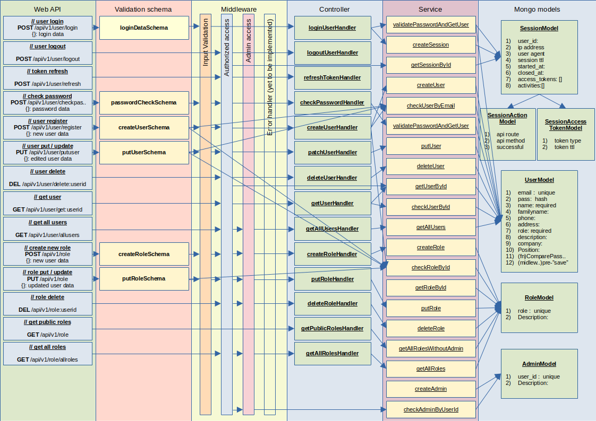
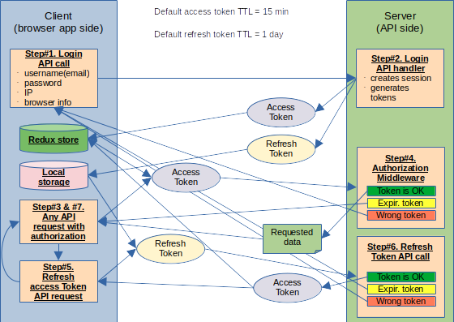
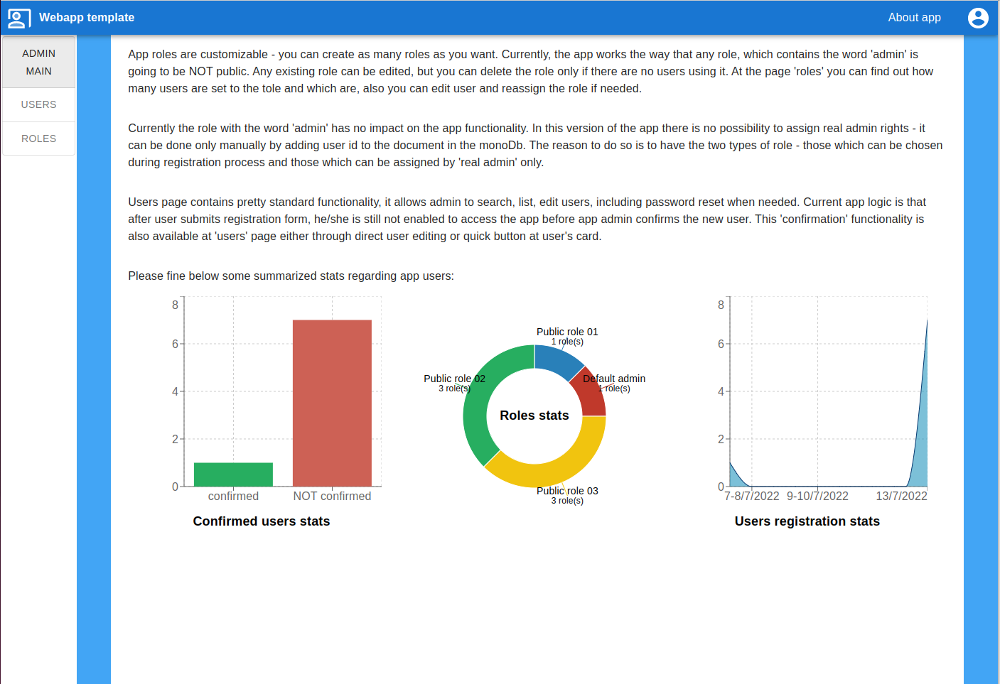
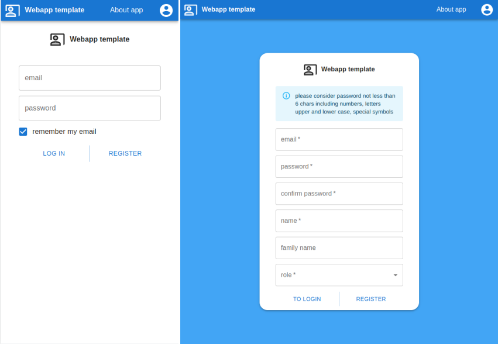
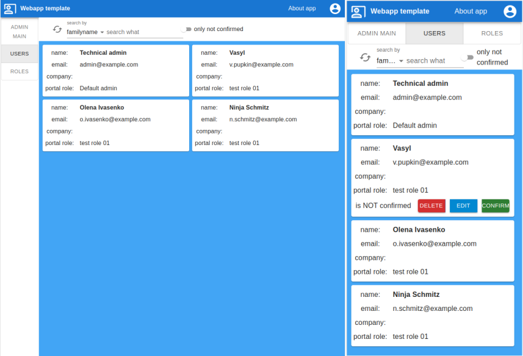

<h1>MERN webapp template in TypeScript with JWT authorization, admin panel</h1>

The purpose of this repository is to have a tested MERN app template with scalable, maintainable architecture, user authorization strategy, admin panel

<h2>Manual content</h2>
<ul>
    <li><a href="#app-functionality">App functionality</a></li>
    <li><a href="#design-approach">General design approach</a></li>
    <li><a href="#reuse-installation">Reuse and installation instructions</a></li>
    <ul>
        <li><a href="#env">.env parameters</a></li>
        <li><a href="#jwt">JWT keys</a></li>
        <li><a href="#first-start">First start</a></li>
        <li><a href="#local-install">Local installation</a></li>
        <li><a href="#docker-dev">Development mode in Docker container</a></li>
        <li><a href="#docker-prod">Production mode in Docker container</a></li>
    </ul>
    <li><a href="#tests">Testing</a></li>
    <li><a href="#to-be-done">To be done / added in further releases</a></li>
    <li><a href="#screenshots">Screenshots</a></li>
</ul>

<h2 id="app-functionality">App functionality</h2>

Working on the side project with my friend, I came to the idea, that it would be very convenient to have an app template with some basic functionality - login / logout, user profile page, new user registration page, admin panel, etc. So this repository is exactly such a template.

Navbar contains link to the "about app" page, user menu. After successful login, user menu contains links to the app starting page, user profile, logout function. For admin users there is also admin panel item in the app menu.

Below the navbar there is the area for app messages. Messages appear after some important events and go away several seconds later.

Login form is pretty standard. App checks that user entered at least some inputs and tries to login. "Remember me" option ensures user email to be stored locally and to be used next time user opens the page after logout."

Register form allows user to sign up for the app account. During registration user has to enter just several things about him/her, much more could be added after registration in "profile" app page. App checks that user entered correct information (email, name formats, password length, etc.), but account is not going to be active until administrator confirms it. This function is available at admin panel.

Profile page allows user to edit / add information about him/her, delete own profile, change password.

Portal roles are custom and could be edited at admin panel. Administrators can add, remove, edit app roles. Currently role has no impact on the app functionality.

Admin panel contains also the page with user list, where admin can confirm new user's access to the app, change user data, passwords.

"About app", "starting app page", "starting admin panel page" are currently empty and are supposed to be added / adjusted later according to the forked app needs.

<h2 id="design-approach">General design approach</h2>

Backend app architecture is based on service - controller approach with heavy usage of middleware (for user authorization, admin access, input validation, etc.). Frontend is based on Model-View-Controller strategy. Please find below diagrams with authorization strategy, JWT tokens strategy, which I use as a handy cheat-sheet if get lost in own code.

<h3>API architecture scheme</h3>

<h3>JWT tokens based authorization strategy</h3>

Frontend architecture diagram is yet to be added here later.

App backend is based on the following technologies: express for api handling, zod for input validation, mongoose and mongo db for database handling.

Frontend is based on react, redux, react-router technologies, mui components. User input validation is based also on zod library, but the functionality is different, so if you change it in one place, do not forget to disable / edit in on the other side. All the text resources are gathered in one big file in "res" folder, app has already the engine to switch interface languages. The button itself is not implemented mainly because the translation into other languages is yet to be done. In general, I already have a some ideas regarding code refactoring, but I am going to tackle this after all the automatic tests implemented.

<h2 id="reuse-installation">Reuse and installation instructions</h2>

Working on the app I had to move from one design environment to another and therefore had to change environmental variable quite often. Just to make it a little bit more convenient, current setup allows user to run the app in several modes and proper environmental variables are supposed to be changed automatically.

    <h3 id="env">.env parameters</h3>
    
 During the start-up app checks the availability of .env file and if there is no one, it creates .env with default values. Please keep in mind, that if you delete only one row or record, app will not catch this. If you feel that you cannot find what is missing in .env, just kill it - app will create the default file with the full set of necessary values. 

    <h3 id="jwt">JWT keys</h3>
    
App requires a folder named "keys" with correct jwt keys pair. During the start-up, app checks that keys are in place and match each other. If app cannot find keys or folder (for instance during the first start-up), it creates both folder and generates keys pair. So, if somewhy your keys are corrupted or lost and there is no special purpose to look for exactly the old ones - just kill the "keys" folder with key(s) and app will create the new and correct ones automatically during the next start-up.

    <h3 id="first-start"> First start</h3>
    
During every start-up app checks at least one admin user and one admin role to be in the database. If there are no ones, app creates default user and role. Default admin username is "admin@example.com", password is "qwerty123". Do not forget to change this password - you can use password generator at the user profile page or admin panel. If admin has default password, app is going to remind you writing this to the server log during every start-up.

    <h3 id="local-install">Local installation</h3>
    
Local installation assumes user to have node.js and either mongo db preinstalled or correct database connection string included to the .env. Yarn package manager is used in this project so it is necessary to run "yarn install" in both client and server folders, then it would be possible to run apps.

    
 For the development purposes please use "yarn dev" for server and "yarn start" for client. For production mode first it is necessary to run "yarn build" in server folder, and then "yarn prod" in the same folder. Please pay attention, that script "yarn build" in server folder silently goes to client folder, runs "yarn build" and copies the "build" folder to "server" folder - thus, even if you are not going to use development mode on a particular PC, it is still necessary to install all the dependencies for the client package.

    <h3 id="docker-dev">Development mode in Docker container</h3>
    
Docker, docker-compose and preferably VSCode are required to use this feature. The correct sequence of actions to continue development in containers is the following. Open project folder in VSCode, then in the left-bottom corner push green button and select open folder in container, open server folder and confirm selection. This action will call docker-compose.dev.yml file in the root project directory and run the whole setup consisting of three nodes - server node based on lts node.js image, client node based also on lts node.js image, mongo db node based on the latest official mongo image. It takes some time to download, install and start all the images during the first start, so please be patient.

    
 Then it is necessary to run separate VSCode window and the same way push green button in the very left-bottom corner of the VSCode window. This time it is necessary to choose "attach to container" option and select client container.

    
In both containers it is necessary to call "yarn install" command and then it is going to be possible to run "yarn dev" for server and "yarn start" for client in order to get the app up and running.

    
Folders mapping is organized the way that all the changes you make in containers are automatically saved to your PC project folder.

    <h3 id="docker-prod">Production mode in Docker container</h3>
    
This is supposed to be the simplest option. If you have the local machine with docker and docker-compose preinstalled the only things which is necessary is either copy the project folder or run "git clone" command and then call "docker-compose up" command. For the single local PC it is going to be sufficient to run the app and access it at http://localhost.

    
Please pay attention that by default git repository does not contain .env and jwt keys files - they are going to be generated in the container during the first run. So, if you are going to deploy the project in distributed environment, you have to go through the code and find yourself the way to organize it - it should not be complicated because all the environmental variables handling is organized either in "config" folder or in .env file.

<h2 id="tests">Testing</h2>

The intention is to cover all the app functionality with proper automated tests. Currently this is still being developed and as for now it is implemented only partly. Server API testing is covered quite good, but latest APIs like "getuser" are yet to be covered by tests. Client part is covered by tests much less and this is yet to be added.

All the automatic testing is based on jest and puppeteer libraries. Please pay attention that for the local installation some additional packages might be required to be installed before you can use puppeteer and e2e testing.

Both for client and server packages testing it is necessary to call "yarn test" command. Server-side testing includes also end-to-end test, which is currently only set up but not filled with any real tests (it just checks window title). The important thing is that if you work in container development environment, it is necessary to run the client part first and only then e2e test will pass. For the local installation option is is necessary to call "yarn build" on the server side first - otherwise your e2e test may not pass.

<h2 id="to-be-done">To be done / added in further releases</h2>

The app itself is manually tested, all the functionality is checked, and we already use this as a starting point for the side app development, but the following features are going to be added:

<ul>
    <li>Automated testing for the whole server package, whole client package and e2e.</li>
    <li>Server part is going to be slightly refactored - there are some direct Mongo model calls bypassing services layer, etc. This is going to be done only after proper automated tests are implemented.</li>
    <li>Client part is going to be refactored, especially client api calls part. This is going to be done only after proper automated tests are implemented.</li>
</ul>

<h2 id="screenshots">Screenshots</h2>

